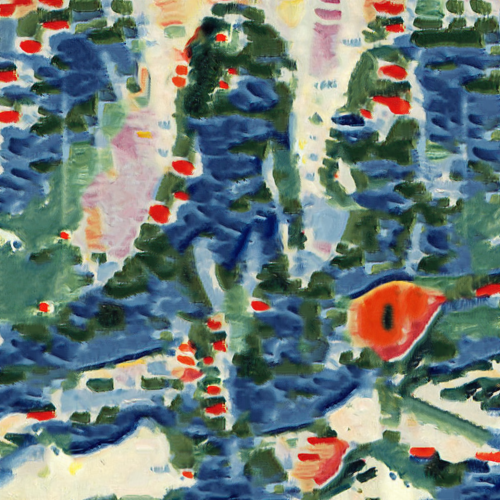

# littlebayatlaciotat

Combina la imagen con la textura del cuadro Little Bay at La Ciotat, de Georges Braque.

Uso:

``` sh
applyeffect littlebayatlaciotat imagen_original [imagen_destino]
```

Si no se indica un nombre para el fichero destino, aplicará el sufijo `_littlebayatlaciotat.png`

Resultado:



