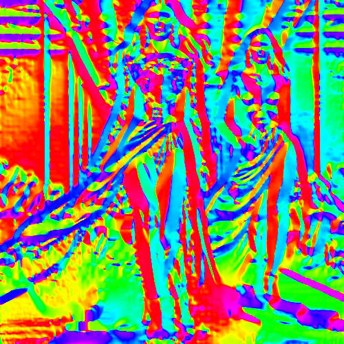

# lucy

Crea un efecto de relieve de la imagen con colores intensos.

Uso:

``` sh
applyeffect lucy imagen_original [imagen_destino]
```

Si no se indica un nombre para el fichero destino, aplicará el sufijo `_lucy.png`

Resultado:



