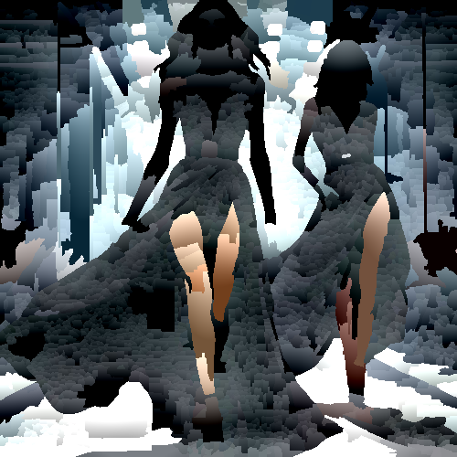

# mineralmosaic

Cambia la textura de la imagen con un efecto pedroso.

Uso:

``` sh
applyeffect mineralmosaic imagen_original [imagen_destino]
```

Si no se indica un nombre para el fichero destino, aplicará el sufijo `_mineral_mosaic.png`

Resultado:



