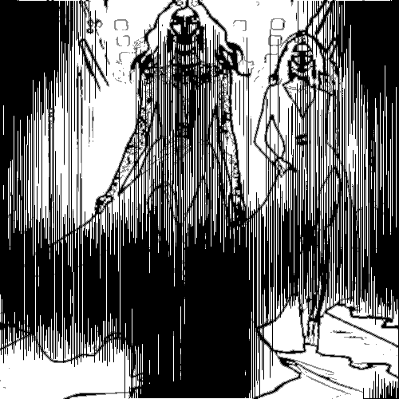

# multilinebw

Dibuja el contorno en negro sobre fondo blanco con una textura de líneas verticales.

Uso:

``` sh
applyeffect multilinebw imagen_original [imagen_destino]
```

Si no se indica un nombre para el fichero destino, aplicará el sufijo `_multilinebw.png`

Resultado:



