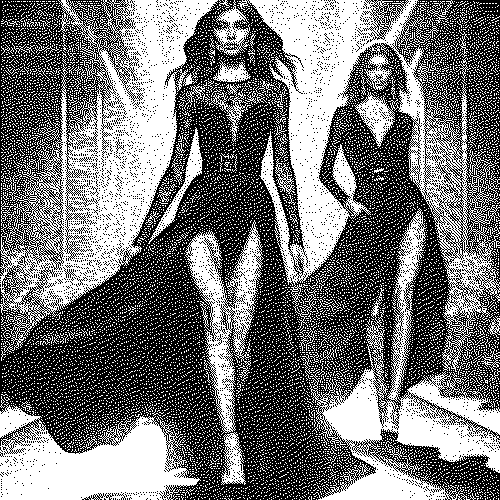

# newspaperdotted

Cambia la textura de la imagen a un punteado blanco y negro.

Uso:

``` sh
applyeffect newspaperdotted imagen_original [imagen_destino]
```

Si no se indica un nombre para el fichero destino, aplicará el sufijo `_newspaper_dotted.png`

Resultado:



