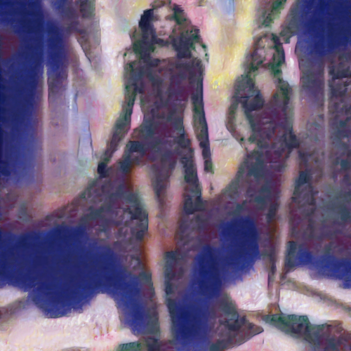

# orientalgarden

Combina la imagen con la textura del cuadro Oriental pleasure garden anagoria, de Paul klee.

Uso:

``` sh
applyeffect orientalgarden imagen_original [imagen_destino]
```

Si no se indica un nombre para el fichero destino, aplicará el sufijo `_orientalpleasuregardenanagoria.png`

Resultado:



