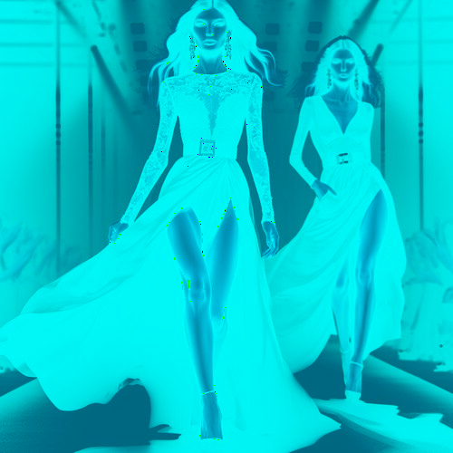

# palesky

Cambia el tono de las zonas oscuras de la imagen a azul grisáceo y las claras, a azul claro.

Uso:

``` sh
applyeffect palesky imagen_original [imagen_destino]
```

Si no se indica un nombre para el fichero destino, aplicará el sufijo `_pale_sky.png`

Resultado:



