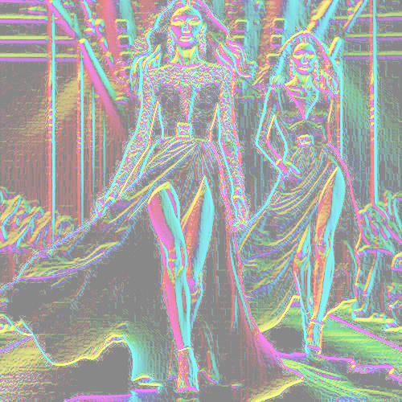

# pastelchalk

Dibuja los contornos de la imagen en tonos rgb claros sobre fondo gris neutro.

Uso:

``` sh
applyeffect pastelchalk imagen_original [imagen_destino]
```

Si no se indica un nombre para el fichero destino, aplicará el sufijo `_pastel_chalk.png`

Resultado:



