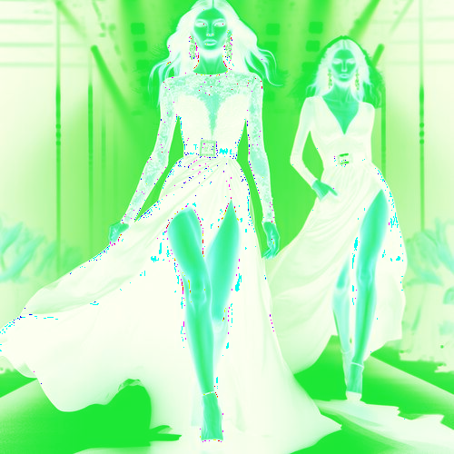

# pearwhite

Cambia el tono de las zonas claras de la imagen a verde pera y las zonas oscuras, a blanco.

Uso:

``` sh
applyeffect pearwhite imagen_original [imagen_destino]
```

Si no se indica un nombre para el fichero destino, aplicará el sufijo `_pear_and_white.png`

Resultado:



