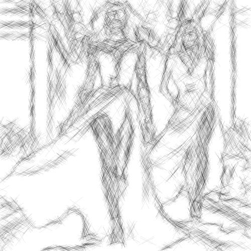

# pencilsketch

Dibuja los contornos de la imagen con líneas finas diagonales negras sobre fondo blanco.

Uso:

``` sh
applyeffect pencilsketch imagen_original [imagen_destino]
```

Si no se indica un nombre para el fichero destino, aplicará el sufijo `_pencil_sketch.png`

Resultado:



