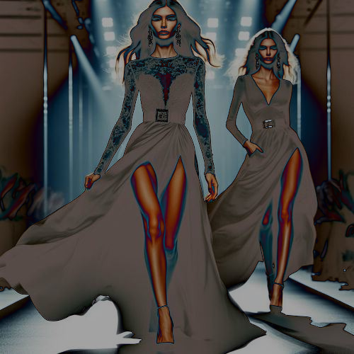

# pointwise

Niega las zonas oscuras de la imagen manteniendo las claras.

Uso:

``` sh
applyeffect pointwise imagen_original [imagen_destino]
```

Si no se indica un nombre para el fichero destino, aplicará el sufijo `_pointwise_absolute.png`

Resultado:



