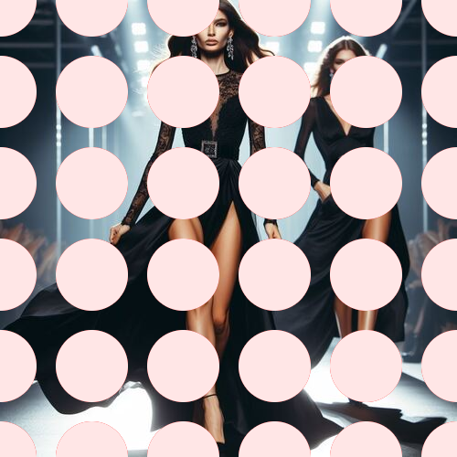

# polkadots

Añade círculos granates sobre la imagen.

Uso:

``` sh
applyeffect polkadots imagen_original [imagen_destino]
```

Si no se indica un nombre para el fichero destino, aplicará el sufijo `_polka_dots.png`

Resultado:



