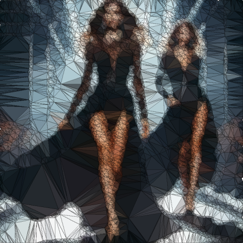

# polygonize

Cambia la textura de la imagen a triángulos de distintos tamaños por unidad de colores.

Uso:

``` sh
applyeffect polygonize imagen_original [imagen_destino]
```

Si no se indica un nombre para el fichero destino, aplicará el sufijo `_polygonize.png`

Resultado:



