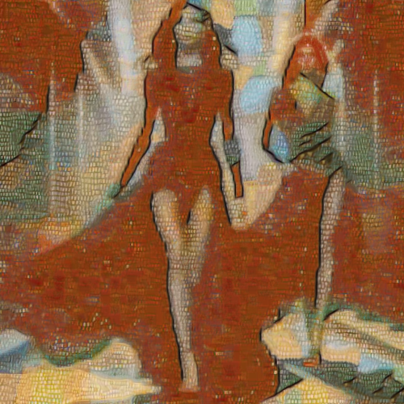

# polyphony2

Combina la imagen con la textura del cuadro Polyphony2, de Paul Klee.

Uso:

``` sh
applyeffect polyphony2 imagen_original [imagen_destino]
```

Si no se indica un nombre para el fichero destino, aplicará el sufijo `_polyphony2.png`

Resultado:



