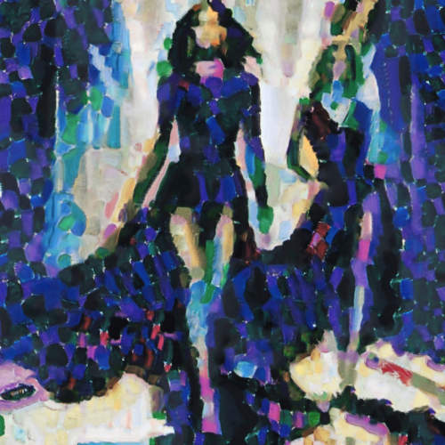

# portrait

Combina la imagen con la textura del cuadro Portrait de Metzinger, de Robert Delaunay.

Uso:

``` sh
applyeffect portrait imagen_original [imagen_destino]
```

Si no se indica un nombre para el fichero destino, aplicará el sufijo `_portraitdemetzinger.png`.

Resultado:



