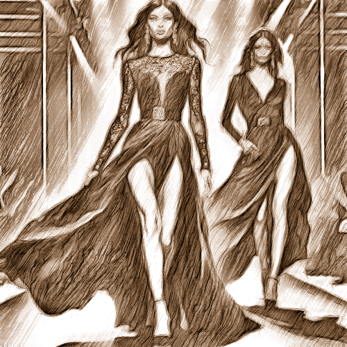

# portraitbw

Cambia la textura de la imagen a líneas diagonales marrones como dibujadas a mano.

Uso:

``` sh
applyeffect portraitbw imagen_original [imagen_destino]
```

Si no se indica un nombre para el fichero destino, aplicará el sufijo `_pencil_portraitbw.png`

Resultado:



