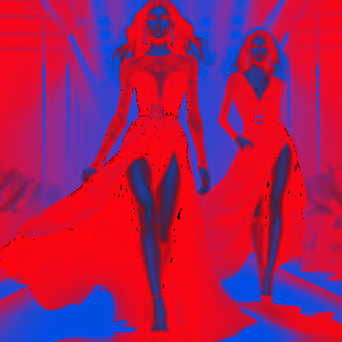

# redbluespectral

Cambia el tono de las zonas claras de la imagen a azul y las zonas oscuras a rojo.

Uso:

``` sh
applyeffect redbluespectral imagen_original [imagen_destino]
```

Si no se indica un nombre para el fichero destino, aplicará el sufijo `_red_blue_spectral.png`

Resultado:



