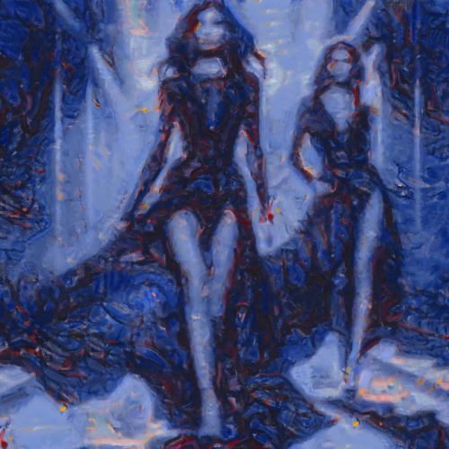

# redtree

Combina la imagen con la textura del cuadro El árbol rojo, de Piet Mondrian.

Uso:

``` sh
applyeffect redtree imagen_original [imagen_destino]
```

Si no se indica un nombre para el fichero destino, aplicará el sufijo `_redtree.png`

Resultado:



