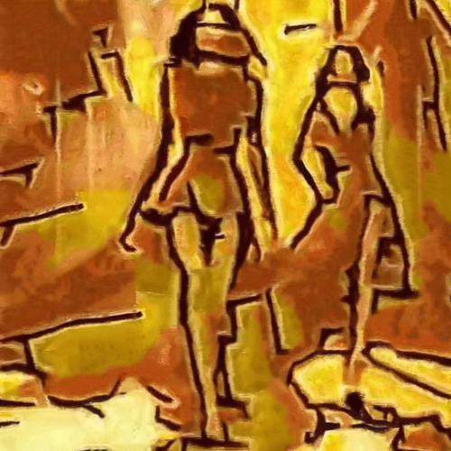

# redwaistcoat

Combina la imagen con la textura del cuadro Red waistcoat, de Paul Klee.

Uso:

``` sh
applyeffect redwaistcoat imagen_original [imagen_destino]
```

Si no se indica un nombre para el fichero destino, aplicará el sufijo `_redwaistcoat.png`

Resultado:



