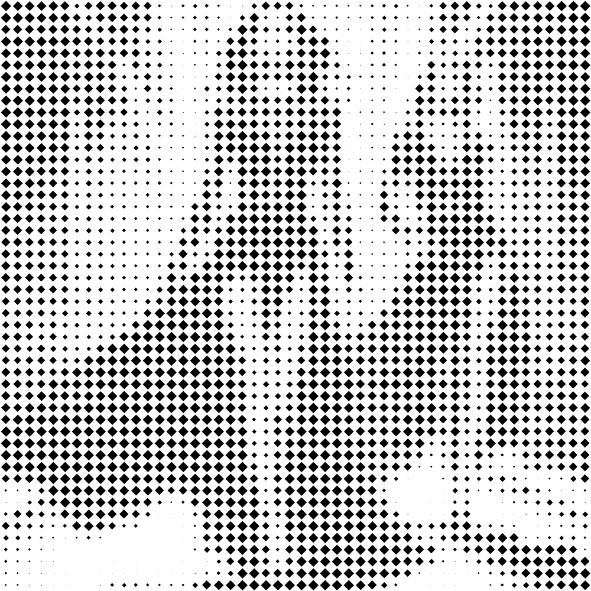

# rhombuses

Convierte la imagen a blanco y negro, sin escala de grises, aplicando una textura con rombos más grandes en las zonas oscuras y rombos pequeños en las zonas claras.

Uso:

``` sh
applyeffect rhombuses imagen_original [imagen_destino]
```

Para cambiar el número de cortes, usar el modificador `--cuts`. Valor por defecto: 10.

Si no se indica un nombre para el fichero destino, aplicará el sufijo `_rhombuses_bw.png`

Resultado:



