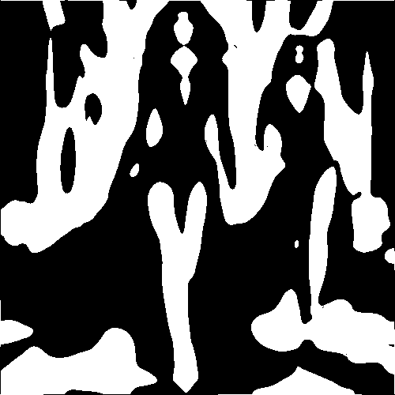

# rorschach

Transforma la imagen a manchas blancas y negras, sin escala de grises.

Uso:

``` sh
applyeffect rorschach imagen_original [imagen_destino]
```

Si no se indica un nombre para el fichero destino, aplicará el sufijo `_rorschach.png`

Resultado:



