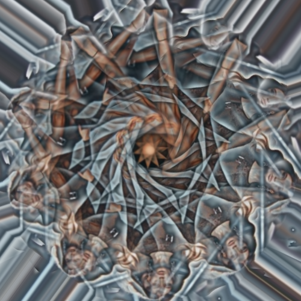

# rotoidoscope

Gira múltiples veces la imagen superponiendo todas ellas.

Uso:

``` sh
applyeffect rotoidoscope imagen_original [imagen_destino]
```

Si no se indica un nombre para el fichero destino, aplicará el sufijo `_rotoidoscope.png`

Resultado:



