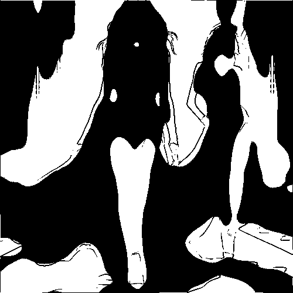

# roundedstains

Convierte la imagen en manchas negras con contornos redondeados sobre fondo blanco, sin escalas de grises.

Uso:

``` sh
applyeffect roundedstains imagen_original [imagen_destino]
```

Si no se indica un nombre para el fichero destino, aplicará el sufijo `_roundedstains.png`

Resultado:



