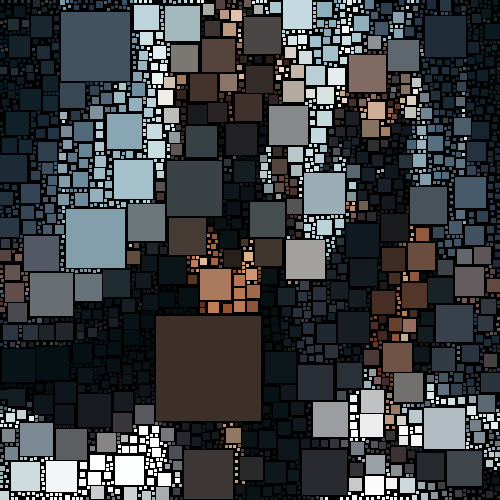

# sectionalboxfitting

Crea una textura de cuadros de desigual tamaño sobre la imagen unificando los colores en cada cuadro.

Uso:

``` sh
applyeffect sectionalboxfitting imagen_original [imagen_destino]
```

Si no se indica un nombre para el fichero destino, aplicará el sufijo `_sectional_boxfitting.png`

Resultado:



