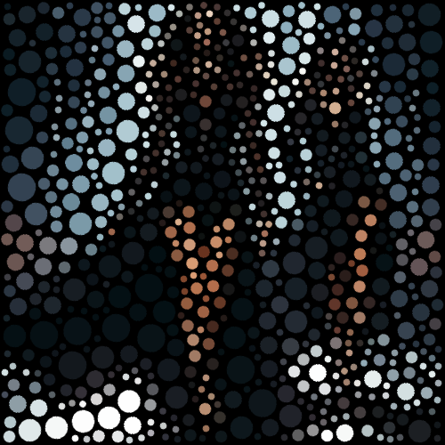

# shapeism

Crea una textura de círculos unificando los colores de la imagen.

Uso:

``` sh
applyeffect shapeism imagen_original [imagen_destino]
```

Si no se indica un nombre para el fichero destino, aplicará el sufijo `_shapeism.png`

Resultado:



