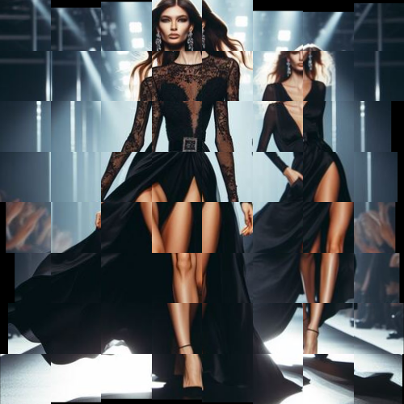

# shifttiles

Crea una textura de 8 x 8 baldosas ligeramente desplazadas.

Uso:

``` sh
applyeffect shifttiles imagen_original [imagen_destino]
```

Si no se indica un nombre para el fichero destino, aplicará el sufijo `_shift_tiles.png`

Resultado:



