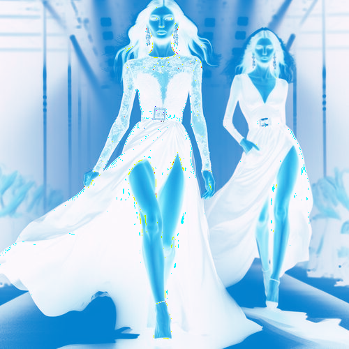

# skyandwhite

Cambia el tono de las zonas claras de la imagen a azul cielo las zonas oscuras a blanco.

Uso:

``` sh
applyeffect skyandwhite imagen_original [imagen_destino]
```

Si no se indica un nombre para el fichero destino, aplicará el sufijo `_sky_and_white.png`

Resultado:



