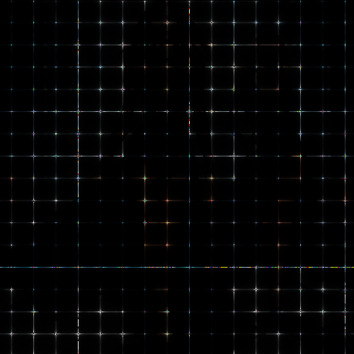

# sparkles

Cambia la textura de la imagen por un fondo negro con destellos regulares.

Uso:

``` sh
applyeffect sparkles imagen_original [imagen_destino]
```

Si no se indica un nombre para el fichero destino, aplicará el sufijo `_sparkles.png`

Resultado:



