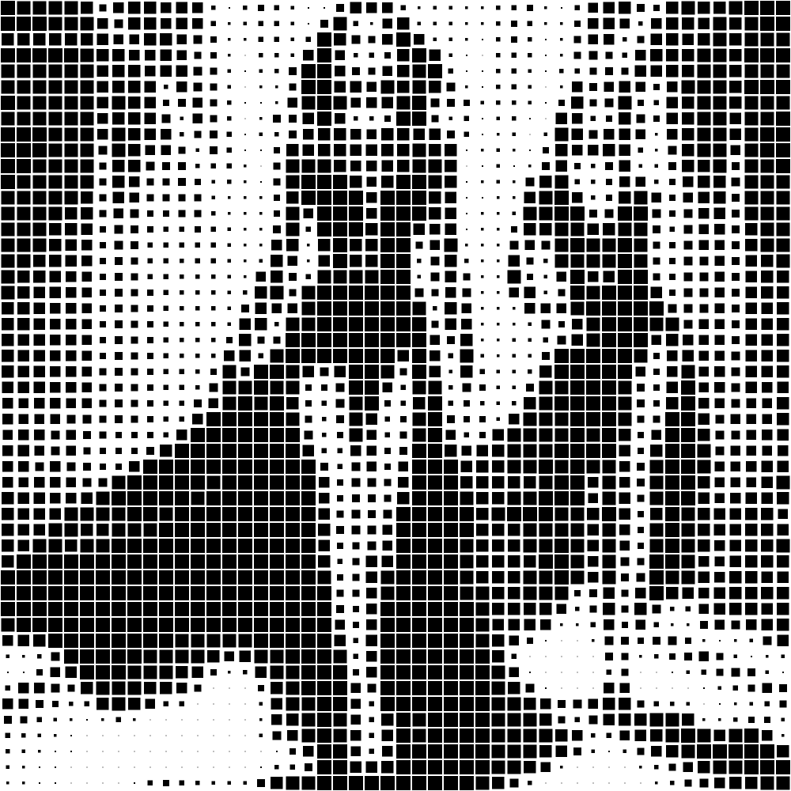

# squares

Transforma la imagen a blanco y negro y crea una textura de cuadros grandes sobre las zonas oscuras de la imagen y cuadros pequeños sobre las zonas claras.

Uso:

``` sh
applyeffect squares imagen_original [imagen_destino]
```

Si no se indica un nombre para el fichero destino, aplicará el sufijo `_squares_bw.png`

Resultado:



