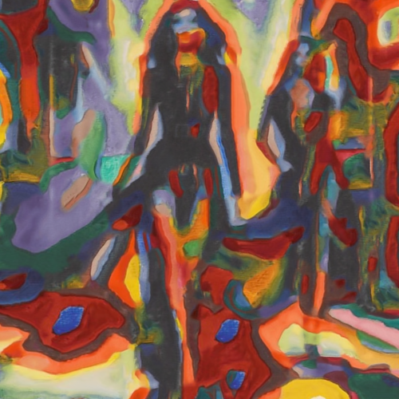

# squarescircles

Combina la imagen con la textura del cuadro Color Study: Squares with Concentric Circles (Estudio de color con cuadros), de Vasili Kandinski.

Uso:

``` sh
applyeffect squarescircles imagen_original [imagen_destino]
```

Si no se indica un nombre para el fichero destino, aplicará el sufijo `_squareswithconcentriccircles.png`

Resultado:



