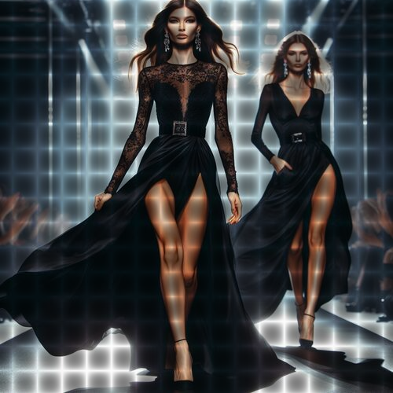

# squaresoflight

Crea una textura de cuadros sombreados sobre la imagen.

Uso:

``` sh
applyeffect squaresoflight imagen_original [imagen_destino]
```

Si no se indica un nombre para el fichero destino, aplicará el sufijo `_squares_of_light.png`

Resultado:



