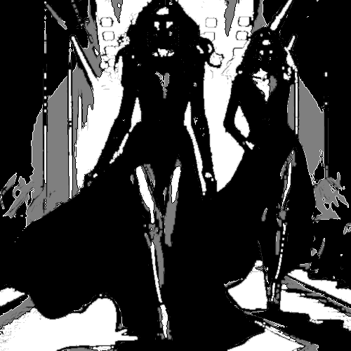

# stainsbw

Convierte a blanco y negro en áreas unificadas con los tonos medios en gris.

Uso:

``` sh
applyeffect stainsbw imagen_original [imagen_destino]
```

Si no se indica un nombre para el fichero destino, aplicará el sufijo `_stainsbw.png`

Resultado:



