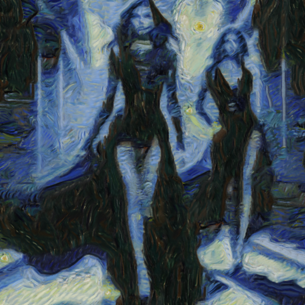

# starrynight

Combina la imagen con la textura del cuadro Starry night (La noche estrellada), de Vincent van Gogh.

Uso:

``` sh
applyeffect starrynight imagen_original [imagen_destino]
```

Si no se indica un nombre para el fichero destino, aplicará el sufijo `_starrynight.png`

Resultado:



