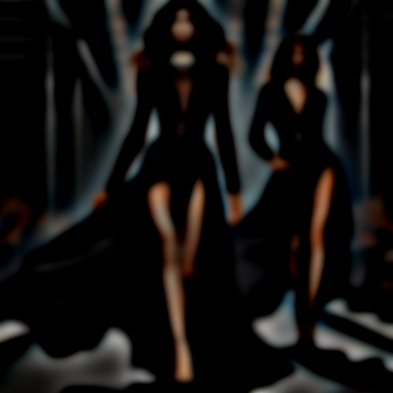

# stencil

Convierte las figuras a negro difuminando los contornos, como una aerografía con plantillas.

Uso:

``` sh
applyeffect stencil imagen_original [imagen_destino]
```

Si no se indica un nombre para el fichero destino, aplicará el sufijo `_stencil.png`

Resultado:



