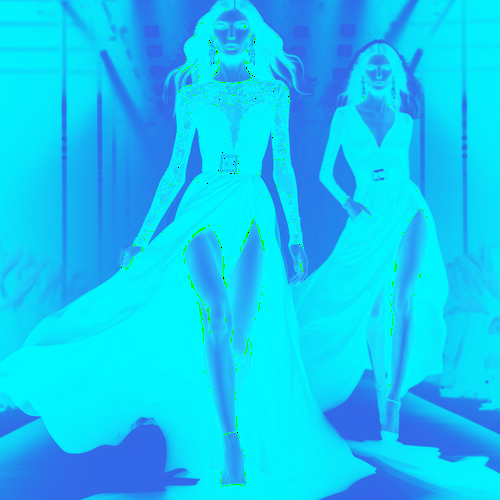

# subtleblue

Cambia el tono de las zonas claras de la imagen a añil y las zonas oscuras a azul celeste.

Uso:

``` sh
applyeffect subtleblue imagen_original [imagen_destino]
```

Si no se indica un nombre para el fichero destino, aplicará el sufijo `_subtle_blue.png`

Resultado:



