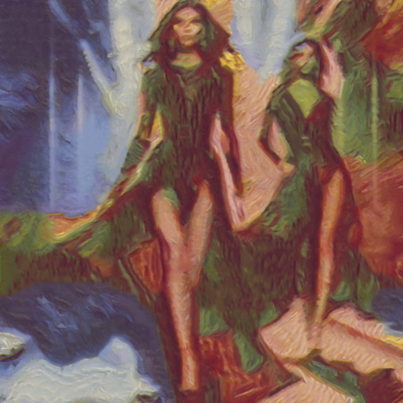

# summer

Combina la imagen con la textura del cuadro Wheatstacks, end of summer (Pilas de trigo, final del verano), de Claude Monet.

Uso:

``` sh
applyeffect summer imagen_original [imagen_destino]
```

Si no se indica un nombre para el fichero destino, aplicará el sufijo `_wheatfieldwithcrows.png`

Resultado:



