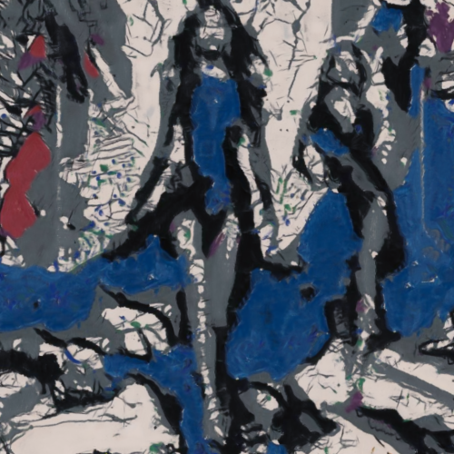

# summertime9a

Combina la imagen con la textura del cuadro Summertime: Number 9A, de Jackson Pollock.

Uso:

``` sh
applyeffect summertime9a imagen_original [imagen_destino]
```

Si no se indica un nombre para el fichero destino, aplicará el sufijo `_summertime9a.png`

Resultado:



