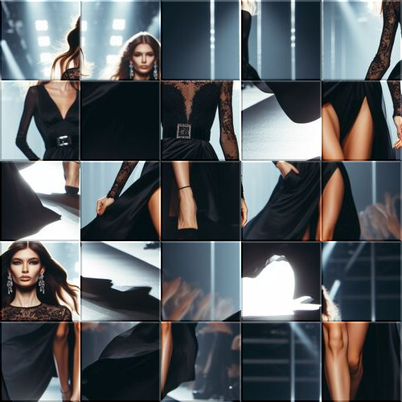

# taquin

Divide la imagen en partes, les aplica una textura de baldosas y recompone la imagen con las baldosas desordenadas.

Uso:

``` sh
applyeffect taquin imagen_original [imagen_destino]
```

Para cambiar la cantidad de baldosas, usar el modificador `--intensity`. Valor por defecto: 5.

Si no se indica un nombre para el fichero destino, aplicará el sufijo `_taquin.png`

Resultado:



