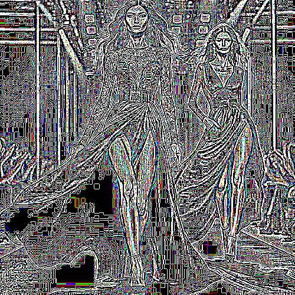

# telesketch

Redibuja la imagen con líneas horizontales y verticales continuas formando cuadros.

Uso:

``` sh
applyeffect telesketch imagen_original [imagen_destino]
```

Si no se indica un nombre para el fichero destino, aplicará el sufijo `_telesketch.png`

Resultado:



