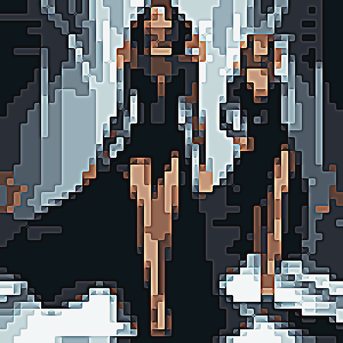

# tetris

Crea una textura de tetris sobre la imagen, uniendo las zonas de color en zonas rectangulares.

Uso:

``` sh
applyeffect tetris imagen_original [imagen_destino]
```

Para cambiar la intensidad del efecto, usar el modificador `--intensity`. Valor por defecto: 10.

Si no se indica un nombre para el fichero destino, aplicará el sufijo `_tetris.png`

Resultado:



