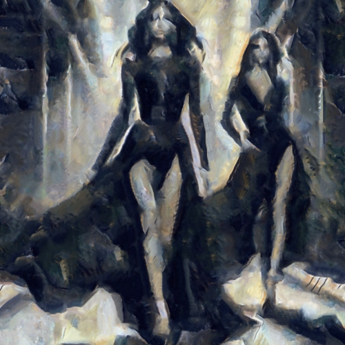

# themandola

Combina la imagen con la textura del cuadro Mandola, de Georges Braque.

Uso:

``` sh
applyeffect themandola imagen_original [imagen_destino]
```

Si no se indica un nombre para el fichero destino, aplicará el sufijo `_themandola.png`

Resultado:



