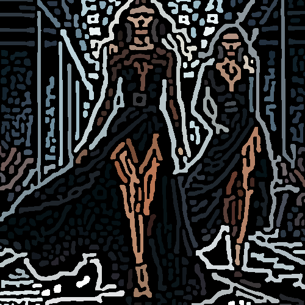

# thickmarker

Redibuja la imagen con una textura de líneas gruesas de color sobre fondo negro.

Uso:

``` sh
applyeffect thickmarker imagen_original [imagen_destino]
```

Para cambiar la intensidad del efecto, usar el modificador `--intensity`. Valor por defecto: 2.

Si no se indica un nombre para el fichero destino, aplicará el sufijo `_thick_marker.png`

Resultado:



