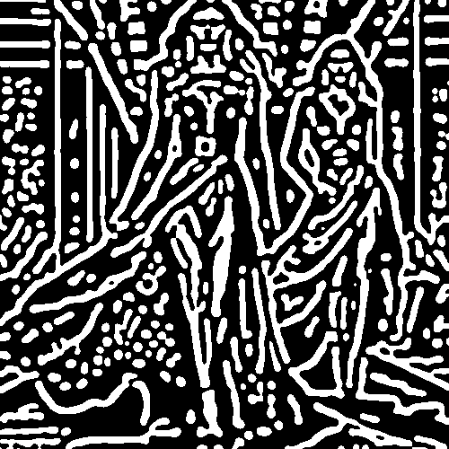

# thickstroke

Redibuja la imagen con una textura de líneas gruesas blancas sobre fondo negro.

Uso:

``` sh
applyeffect thickstroke imagen_original [imagen_destino]
```

Si no se indica un nombre para el fichero destino, aplicará el sufijo `_thick_stroke.png`

Resultado:



