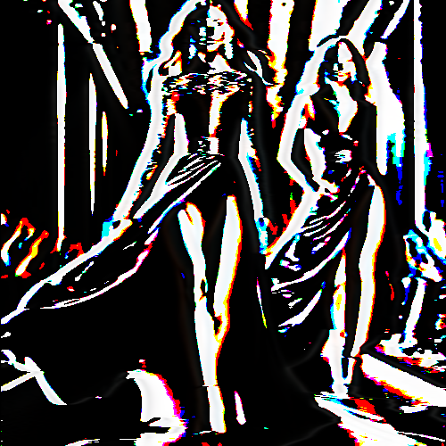

# vanvliet

Convierte las zonas oscuras de la imagen a negro, las claras a blanco y los medios, a colores CMYK.

Uso:

``` sh
applyeffect vanvliet imagen_original [imagen_destino]
```

Si no se indica un nombre para el fichero destino, aplicará el sufijo `_vanvliet.png`

Resultado:



