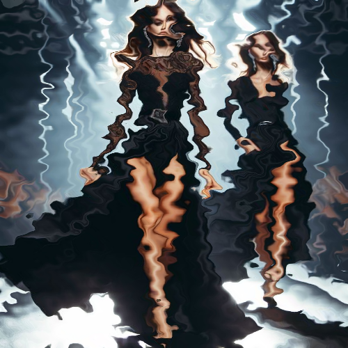

# water

Ondula la imagen como si estuviera reflejada en el agua.

Uso:

``` sh
applyeffect water imagen_original [imagen_destino]
```

Si no se indica un nombre para el fichero destino, aplicará el sufijo `_water.png`

Resultado:



