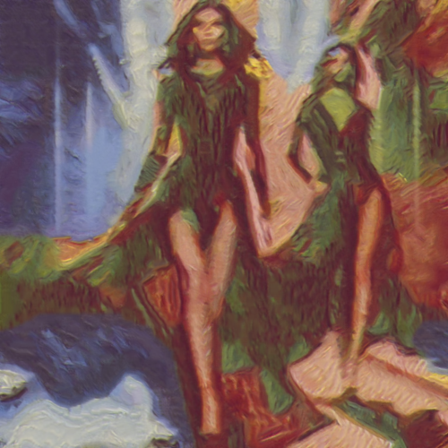

# wheatfield

Combina la imagen con la textura del cuadro Wheat Field with Crows (Trigal con cuervos), de Vincent van Gogh.

Uso:

``` sh
applyeffect wheatfield imagen_original [imagen_destino]
```

Si no se indica un nombre para el fichero destino, aplicará el sufijo `_wheatfieldwithcrows.png`

Resultado:



