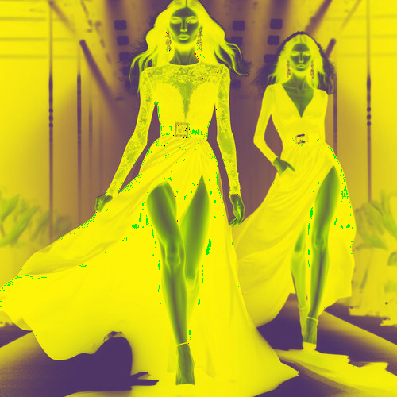

# yellowandpurple

Cambia el tono de las zonas claras de la imagen a morado y las zonas oscuras a amarillo.

Uso:

``` sh
applyeffect yellowandpurple imagen_original [imagen_destino]
```

Si no se indica un nombre para el fichero destino, aplicará el sufijo `_yellow_and_purple.png`

Resultado:



