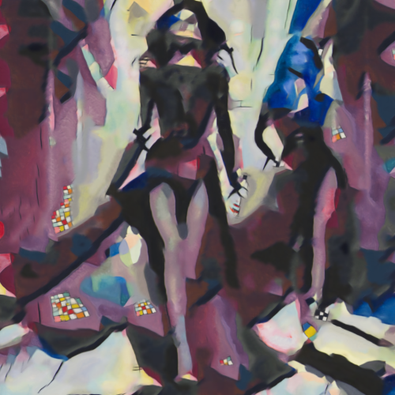

# yellowredblue

Combina la imagen con la textura del cuadro Yellow-Red-Blue, de Wassily Kandinsky.

Uso:

``` sh
applyeffect yellowredblue imagen_original [imagen_destino]
```

Si no se indica un nombre para el fichero destino, aplicará el sufijo `_yellowredblue.png`

Resultado:



